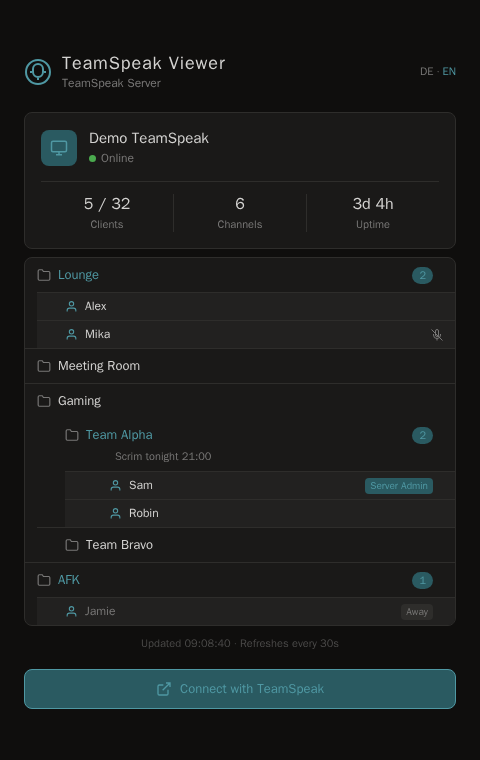

# ts-viewer

[](https://github.com/Don-Wombat/ts-viewer/actions/workflows/ci.yml)

A lightweight, self-hostable PHP page that shows, live via ServerQuery, who's
currently connected to a TeamSpeak server (channel tree incl. topic, online
clients with away/mute status and role badge). One PHP process + Docker, no
Node toolchain, no admin panel — deliberately just a read-only live view. UI
available in German and English.

Supports TeamSpeak 3 (from server version 3.3.0), TeamSpeak 5 and TeamSpeak 6.



*(Demo data — not a real server.)*

## Features

- Live channel tree with online client count, away/mute status and a role
  badge (e.g. "Server Admin")
- Channel topics
- German/English UI, switchable per visitor
- Configurable branding (title, subtitle, theme colors, connect button)
- SSH or unencrypted raw ServerQuery transport — works with TS3, TS5 and TS6
- `?health=1` endpoint + Docker `HEALTHCHECK` for uptime monitoring
- Ships as a single Docker image, no build tooling or database required

## Setup

```bash
cp .env.example .env    # fill in
docker compose -f docker-compose.example.yml up -d --build
```

`docker-compose.example.yml` builds from the tagged GitHub release by
default. Alternatively, prebuilt images are available at
[`ghcr.io/don-wombat/ts-viewer`](https://github.com/Don-Wombat/ts-viewer/pkgs/container/ts-viewer)
(e.g. `ghcr.io/don-wombat/ts-viewer:v0.1.6.2` or `:latest`) — just swap
`build:` for `image: ghcr.io/don-wombat/ts-viewer:<tag>` in
`docker-compose.example.yml` to skip the local build.

A dedicated, read-only ServerQuery login is recommended on the TS server
(not the admin account) — the app only needs read access to `serverinfo`,
`channellist`, `clientlist` and `servergrouplist` (for the role badge, e.g.
"Server Admin").

For uptime monitoring: `?health=1` returns `ok` (text, HTTP 200) without a TS
server roundtrip — just a check that PHP/Apache are running. The Docker
container also has a built-in `HEALTHCHECK` on the same endpoint.

### Choosing a transport

| `TS_TRANSPORT` | Port (default) | Encrypted | Available from |
|---|---|---|---|
| `ssh` (recommended) | 10022 | yes | TS3 ≥ 3.3.0, TS5, TS6 |
| `raw` | 10011 | **no** | all TS3/TS5 versions |

- **`ssh`**: The TS server must have SSH ServerQuery enabled
  (`query_protocols=raw,ssh` in the server config). TS6 currently supports
  only this transport.
- **`raw`**: classic, unencrypted telnet-like ServerQuery. Enabled by
  default on many older TS3/TS5 installations, but transmits the password
  and all server data in plain text — only use it on a trusted/local
  network, otherwise prefer `ssh`.

TS6 support is expected to work but hasn't been extensively verified across
different TS6 server versions.

## Configuration (environment variables)

| Variable | Required | Default | Meaning |
|---|---|---|---|
| `TS_HOST` | yes | – | Hostname/IP of the TS server |
| `TS_USER` | yes | – | ServerQuery login name |
| `TS_PASS` | yes | – | ServerQuery password |
| `TS_TRANSPORT` | no | `ssh` | `ssh` \| `raw` |
| `TS_PORT` | no | `10022` (ssh) / `10011` (raw) | ServerQuery port |
| `TS_VPORT` | no | `9987` | virtual server (voice port) |
| `TS_QUERY_NICKNAME` | no | `TS-Viewer` | Nickname under which the query connection is visible in the client window |
| `TS_CONNECT_TIMEOUT` | no | `5` | Timeout in seconds for establishing the connection |
| `TS_CACHE_DIR` | no | `/var/cache/ts-viewer` | Directory for cache/lock/known_hosts |
| `TS_CACHE_TTL` | no | `30` | Cache validity on success (seconds) |
| `TS_CACHE_ERROR_TTL` | no | `10` | Cache validity on errors (shorter, prevents a connection storm) |
| `TS_TIMEZONE` | no | `Europe/Berlin` | Timezone for the "updated at" display |
| `TS_BRAND_TITLE` | no | `TeamSpeak Viewer` | `<title>` + header text |
| `TS_BRAND_SUBTITLE` | no | `TeamSpeak Server` | Subtitle in the header |
| `TS_CONNECT_URL` | no | empty (connect button hidden) | e.g. `ts3server://ts.example.org` |
| `TS_THEME_CSS_OVERRIDE` | no | empty | raw CSS block, overrides the `:root` variables from `html/assets/style.css` |
| `TS_DEFAULT_LANG` | no | `de` | Default language (`de`\|`en`), see [Language](#language) |

## Language

The UI is available in German and English. Every visitor can switch via the
header toggle ("DE · EN") — the choice is remembered via a cookie. Without a
selection, `TS_DEFAULT_LANG` applies (default `de`). New UI strings are
maintained in `html/lib/i18n.php`, see [CONTRIBUTING.md](CONTRIBUTING.md).

## Security notes

- Use a dedicated, read-only ServerQuery login instead of the admin account.
- Prefer the `ssh` transport; `raw` transmits the password and server data
  in plain text.
- With the `ssh` transport, the host key is pinned on first connect
  (`StrictHostKeyChecking=accept-new`) and stored in
  `TS_CACHE_DIR/known_hosts` — if the key changes afterwards (e.g. due to a
  MITM), the connection fails instead of silently going through.
- Cache, lock file and `known_hosts` live in a dedicated, non-world-writable
  directory (`0700`, `www-data`) instead of `/tmp`. The container entrypoint
  resets these permissions on every start (not just at image build time),
  since a volume or bind mount at `TS_CACHE_DIR` would otherwise override
  the permissions set in the image.
- HTTP security headers (`X-Content-Type-Options: nosniff`,
  `Referrer-Policy: no-referrer`, `X-Frame-Options: DENY`,
  `Content-Security-Policy: frame-ancestors 'none'`) on every response,
  including `?ajax=1`/`?health=1`.
- All values coming from the TS server (channel/nicknames, topics, group
  names) pass through `htmlspecialchars()` before output — including role
  badges and the channel topic (new since v0.1.6).

## Development

```bash
php -l html/index.php html/config.php html/lib/*.php bin/*.php   # syntax check
php bin/selftest_parser.php                                        # protocol self-test
php bin/test_raw_transport.php                                     # transport integration test against a mock socket
```

See [CONTRIBUTING.md](CONTRIBUTING.md) for more details (conventions, i18n
strings, security disclosures).

## Changelog

See [CHANGELOG.md](CHANGELOG.md).

## License

MIT, see [LICENSE](LICENSE).
