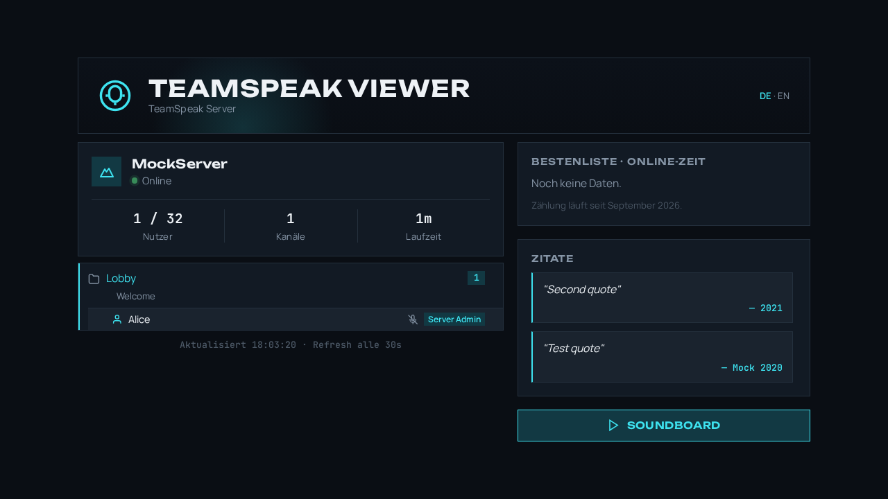

# ts-viewer

[](https://github.com/Don-Wombat/ts-viewer/actions/workflows/ci.yml)

A lightweight, self-hostable PHP page that shows, live via ServerQuery, who's
currently connected to a TeamSpeak server (channel tree incl. topic, online
clients with away/mute status and role badge), plus a handful of optional
community extras (quote box, online-time leaderboard, password-gated
soundboard). One PHP process + Docker, no Node toolchain, no admin panel.
UI available in German and English.

Supports TeamSpeak 3 (from server version 3.3.0), TeamSpeak 5 and TeamSpeak 6.



*(Demo data — not a real server.)*

## Features

- Live channel tree with online client count, away/mute status and a role
  badge (e.g. "Server Admin")
- Channel topics
- TeamSpeak-client-accurate spacer channel rendering (section headings and
  plain dividers), and optional exact-name channel hiding (`TS_HIDDEN_CHANNELS`)
- Optional quote box next to the tree, reading from a channel's description
  (`TS_QUOTE_CHANNEL_ID`)
- Optional online-time leaderboard, tracked by a background poller
  independent of website traffic (`TS_TRACK_ONLINE_TIME`)
- Optional password-gated soundboard subpage for a directory of short clips
  (`TS_SOUNDS_DIR` + `TS_SOUNDBOARD_PASSWORD`), see [Soundboard](#soundboard)
- German/English UI, switchable per visitor
- Configurable branding (title, subtitle, founding year, theme colors, connect button)
- SSH or unencrypted raw ServerQuery transport — works with TS3, TS5 and TS6
- `?health=1` endpoint + Docker `HEALTHCHECK` for uptime monitoring
- Ships as a single Docker image, no build tooling or database required

## Setup

```bash
cp .env.example .env    # fill in
docker compose -f docker-compose.example.yml up -d --build
```

`docker-compose.example.yml` builds from the tagged GitHub release by
default. Alternatively, prebuilt images are available at
[`ghcr.io/don-wombat/ts-viewer`](https://github.com/Don-Wombat/ts-viewer/pkgs/container/ts-viewer)
(e.g. `ghcr.io/don-wombat/ts-viewer:v0.1.7` or `:latest`) — just swap
`build:` for `image: ghcr.io/don-wombat/ts-viewer:<tag>` in
`docker-compose.example.yml` to skip the local build.

A dedicated, read-only ServerQuery login is recommended on the TS server
(not the admin account) — the app only needs read access to `serverinfo`,
`channellist`, `clientlist` and `servergrouplist` (for the role badge, e.g.
"Server Admin").

For uptime monitoring: `?health=1` returns `ok` (text, HTTP 200) without a TS
server roundtrip — just a check that PHP/Apache are running. The Docker
container also has a built-in `HEALTHCHECK` on the same endpoint.

### Choosing a transport

| `TS_TRANSPORT` | Port (default) | Encrypted | Available from |
|---|---|---|---|
| `ssh` (recommended) | 10022 | yes | TS3 ≥ 3.3.0, TS5, TS6 |
| `raw` | 10011 | **no** | all TS3/TS5 versions |

- **`ssh`**: The TS server must have SSH ServerQuery enabled
  (`query_protocols=raw,ssh` in the server config). TS6 currently supports
  only this transport.
- **`raw`**: classic, unencrypted telnet-like ServerQuery. Enabled by
  default on many older TS3/TS5 installations, but transmits the password
  and all server data in plain text — only use it on a trusted/local
  network, otherwise prefer `ssh`.

TS6 support is expected to work but hasn't been extensively verified across
different TS6 server versions.

## Configuration (environment variables)

| Variable | Required | Default | Meaning |
|---|---|---|---|
| `TS_HOST` | yes | – | Hostname/IP of the TS server |
| `TS_USER` | yes | – | ServerQuery login name |
| `TS_PASS` | yes | – | ServerQuery password |
| `TS_TRANSPORT` | no | `ssh` | `ssh` \| `raw` |
| `TS_PORT` | no | `10022` (ssh) / `10011` (raw) | ServerQuery port |
| `TS_VPORT` | no | `9987` | virtual server (voice port) |
| `TS_QUERY_NICKNAME` | no | `TS-Viewer` | Nickname under which the query connection is visible in the client window |
| `TS_CONNECT_TIMEOUT` | no | `5` | Timeout in seconds for establishing the connection |
| `TS_CACHE_DIR` | no | `/var/cache/ts-viewer` | Directory for cache/lock/known_hosts |
| `TS_CACHE_TTL` | no | `30` | Cache validity on success (seconds) |
| `TS_CACHE_ERROR_TTL` | no | `10` | Cache validity on errors (shorter, prevents a connection storm) |
| `TS_TIMEZONE` | no | `Europe/Berlin` | Timezone for the "updated at" display |
| `TS_BRAND_TITLE` | no | `TeamSpeak Viewer` | `<title>` + header text |
| `TS_BRAND_SUBTITLE` | no | `TeamSpeak Server` | Subtitle in the header |
| `TS_FOUNDED_YEAR` | no | empty (not shown) | Shown as "· since {year}" next to the subtitle |
| `TS_CONNECT_URL` | no | empty (connect button hidden) | e.g. `ts3server://ts.example.org` |
| `TS_THEME_CSS_OVERRIDE` | no | empty | raw CSS block, overrides the `:root` variables from `html/assets/style.css` |
| `TS_DEFAULT_LANG` | no | `de` | Default language (`de`\|`en`), see [Language](#language) |
| `TS_HIDDEN_CHANNELS` | no | empty (off) | Comma-separated exact channel names to hide from the tree entirely (channel + its clients/subchannels) |
| `TS_QUOTE_CHANNEL_ID` | no | empty (off) | Channel ID whose description holds quotes (one per paragraph), shown next to the tree |
| `TS_TRACK_ONLINE_TIME` | no | empty (off) | Enables the online-time leaderboard's background poller |
| `TS_TRACK_INTERVAL` | no | `60` | Poll interval in seconds for the online-time tracker |
| `TS_SOUNDS_DIR` | no | empty (off) | Directory of soundboard clips (bind-mounted, see [Soundboard](#soundboard)) — needs `TS_SOUNDBOARD_PASSWORD` too |
| `TS_SOUNDBOARD_PASSWORD` | no | empty (off) | Password gating the soundboard subpage — needs `TS_SOUNDS_DIR` too |

## Language

The UI is available in German and English. Every visitor can switch via the
header toggle ("DE · EN") — the choice is remembered via a cookie. Without a
selection, `TS_DEFAULT_LANG` applies (default `de`). New UI strings are
maintained in `html/lib/i18n.php`, see [CONTRIBUTING.md](CONTRIBUTING.md).

## Soundboard

An optional, password-gated subpage (`soundboard.php`) listing short audio
clips, reachable via a button under the quote box. Off unless both
`TS_SOUNDS_DIR` and `TS_SOUNDBOARD_PASSWORD` are set — a directory with no
password would mean a public soundboard, which defeats the point.

- Point `TS_SOUNDS_DIR` at a directory bind-mounted read-only into the
  container (see the `Sounds/` volume in `docker-compose.example.yml`) — one
  subfolder per section (e.g. one per person), root-level files grouped
  under "General". The list is read fresh on every page load: add/remove
  files on the host, no rebuild or restart needed.
- Every file gets a button labeled with its uppercased filename (extension
  stripped). Clicking always restarts playback from the beginning, even on
  an already-playing or already-finished clip. A floating bar lets visitors
  stop playback and adjust volume without scrolling back to the grid.
- The password gate is enforced server-side on both the page and the audio
  endpoint (`sound.php`), including per-IP rate limiting on the login
  itself — see [SECURITY.md](SECURITY.md) for details.

## Security

See [SECURITY.md](SECURITY.md) for security-relevant design decisions
(credential handling, transport choice, cache directory permissions, the
soundboard's session cookie and login rate limiting, ...) and how to report
a vulnerability.

## Development

```bash
php -l html/*.php html/lib/*.php bin/*.php   # syntax check
php bin/selftest_parser.php                  # protocol self-test
php bin/test_raw_transport.php               # transport integration test against a mock socket
```

See [CONTRIBUTING.md](CONTRIBUTING.md) for more details (conventions, i18n
strings, security disclosures).

## Changelog

See [CHANGELOG.md](CHANGELOG.md).

## License

MIT, see [LICENSE](LICENSE).
